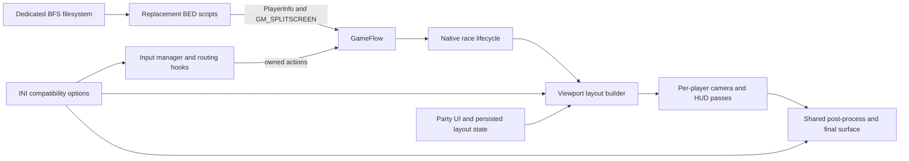
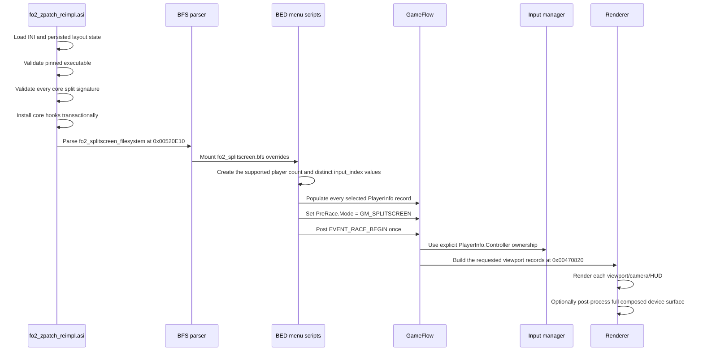
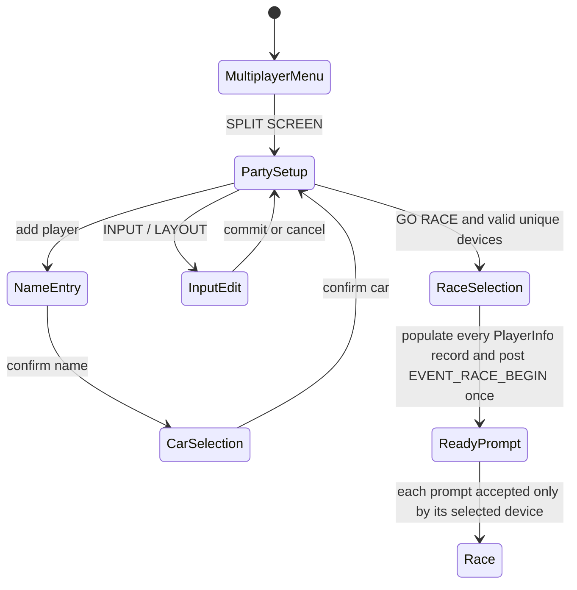

# FlatOut 2 PC split-screen architecture

This document records the evidence, current design, and extension boundary for the
split-screen implementation in `modules/zpatch_reimpl`. Its main purpose is to keep
future multi-player work from repeating the two-player reverse-engineering
or mistaking dormant rendering paths for complete multi-player support. Three-player
and four-player input remain separate capabilities: the stock PC topology exposes
keyboard plus two pads, while the fourth player uses a separately validated XInput
slot-3 adapter. Four physical pads remain a different, unsupported topology.

The implementation is experimental and is pinned to the current Steam executable:

| Property | Verified value |
| --- | --- |
| `FlatOut2.exe` SHA-256 | `B7F691D098A167AD0C6C6FF4604DE6F653EFDCF93B6ACBDD03960973A122641F` |
| Image base | `0x00400000` |
| `SizeOfImage` | `0x00541000` |
| PE timestamp | `0x451D02BD` |
| Game mode | `GM_SPLITSCREEN == 10` |
| Current supported player count | 2 or 3; 4 when the startup XInput slot-3 transaction succeeds |
| Native viewport counts explicitly laid out by the PC executable | 1, 2, and 4; count 3 is incomplete |

Addresses below are virtual addresses in that executable unless stated otherwise.
They must not be treated as portable offsets for another release.

## System boundary

Split screen crosses four independently fragile layers. A successful menu transition
does not prove that input ownership, rendering, or post-processing is correct.



The repository owns only the replacement menu scripts and the patching layer. Race,
camera, HUD, physics, and viewport iteration remain native engine systems.

## Startup and race lifecycle



Installation order is intentional. The filesystem mount is the last core patch site,
so replacement scripts cannot enter `GM_SPLITSCREEN` until the player-count, ready
ownership, input-routing, and post-process detours are all live. All signatures are
validated before the first core write; any failed write rolls the transaction back.

## Source and asset map

| Concern | Repository source | Runtime artifact |
| --- | --- | --- |
| Split entry, race selection, `PlayerInfo` population | `modules/zpatch_reimpl/assets/splitscreen/data/scripts/multiplayermenu.bed` | `data/scripts/multiplayermenu.bed` in `fo2_splitscreen.bfs` |
| Player creation, car selection, input selector | `modules/zpatch_reimpl/assets/splitscreen/data/scripts/partymodemenu.bed` | `data/scripts/partymodemenu.bed` in `fo2_splitscreen.bfs` |
| Native hooks, version gates, layout, input, post-process | `modules/zpatch_reimpl/fo2_zpatch_reimpl.cpp` | `fo2_zpatch_reimpl.asi` |
| Feature configuration | `modules/zpatch_reimpl/fo2_zpatch_reimpl.ini` | `fo2_zpatch_reimpl.ini` |
| Archive build and verification | `modules/zpatch_reimpl/build_splitscreen_bfs.ps1` | generated `fo2_splitscreen.bfs` and 19-byte `fo2_splitscreen_filesystem` |
| Runtime layout selection | party-menu selector and direct native `Input` getter/setters | ASI-owned `fo2_splitscreen_layout.lua` containing exactly `return 0` or `return 1` |

The BFS is a build output, not source. The filesystem file must contain exactly
`fo2_splitscreen.bfs` with no BOM or line ending. The runtime refuses to install the
split hooks if either file is missing or the manifest bytes differ.

## Runtime data model

### GameFlow

The global GameFlow pointer is stored at `0x008E8410`.

| GameFlow location | Meaning | Current use |
| ---: | --- | --- |
| `+0x464` | game mode | must equal 10 before mode-scoped routing, layout rewriting, or the post-process fix activates |
| `+0x614 + i*0x44` | inferred base of `PlayerInfo[i]` | eight records are present in the pinned PC executable |
| `+0x620 + i*0x44` | player type field used by the native counter | `0x0045DC80` compares all eight records |
| `+0x624 + i*0x44` | `PlayerInfo[i].Controller` | zero-based input-device index used by ready ownership |
| `+0x91C` | race/menu state | value 6 identifies the split ready/start prompt for Zoom compatibility |
| `+0x9CC` | current ready-prompt player ordinal | current code accepts ordinals below the validated contiguous local count, capped at 3 players |

`0x0045DC80` explicitly tests records at `+0x620`, `+0x664`, `+0x6A8`,
`+0x6EC`, `+0x730`, `+0x774`, `+0x7B8`, and `+0x7FC`. This is strong native
evidence for eight `PlayerInfo` slots. It is not evidence for eight simultaneous
input devices or eight rendered viewports.

### Input manager

The global input-manager pointer is stored at `0x008E844C`. The manager is a
`0x154`-byte object allocated at `0x005214D2`; its device-populating constructor
begins at `0x0054FF10`. The `0x7A0` allocation inside that function is the keyboard
device, not the manager.

| Input-manager location | Stock/current meaning | Extension consequence |
| ---: | --- | --- |
| `+0x04` | registered device count; stock finishes at 3 when both pads exist | count-driven loops see keyboard plus two pads |
| `+0x08` | local-multiplayer threshold/state; stock writes 1, current hook writes 2 | keep 2; it is not the rendered/player-record count |
| `+0x10` | last device whose aggregate action query matched | GUI and ready attribution consume the zero-based index |
| `+0x14` | mutable current player/action context; retained at stock value 1 | do not conflate it with player count |
| `+0x18` | current action-map/state pointer | many manager and screen transitions read or replace it |
| `+0x1C` | keyboard device pointer | device index 0 |
| `+0x20` | first pad device pointer | device index 1 |
| `+0x24` | second pad device pointer | device index 2 |
| `+0x28` | controller-backend pointer | count 4 would misinterpret it as device index 3 |
| `+0x2C` | input/focus-blocking state | not spare device storage |

An exhaustive direct-reader audit found only three uses of `+0x08`:

- `0x00460A14` tests whether it is greater than 1;
- `0x004947C4` rejects split launch when it is below 2; and
- `0x004959E6` selects a multiplayer formatting branch when it is at least 2.

The actual local-player count comes from the `PlayerInfo.Type` scan at
`0x0045DC80`. No proven consumer requires `+0x08` to equal 3 or 4, so future work
must leave the current value 2 unless new evidence contradicts this threshold
interpretation.

The constructor creates pad objects only for backend entries `+0x4674` and
`+0x4678`. Backend update `0x0055B490` is explicitly bounded by `index < 2`; a
second per-pad pointer array occupies `+0x467C/+0x4680`, and pad state is addressed
as `backend + 0x4444 + index*0x104`. A third such record would overlap metadata
near `+0x466C`. This is a hard two-pad backend, not an enumeration setting.

The stock registry therefore safely exposes at most keyboard plus two pads. A plain
`+0x04 = 4` patch is invalid because generic loops would virtual-call through the
backend pointer. The implemented keyboard-plus-three-pads extension instead saves
the real backend in an ASI sidecar, redirects its central update and destruction,
repurposes manager `+0x28` as contiguous device slot 3, and publishes count 4 only
after a game-compatible XInput adapter completes initialization.

The adapter is an `0x8EC` native-layout pad object with a private `0x5098` shadow
backend. Its writable clone of the 54-entry stock pad vtable overrides deleting
destruction, per-frame polling, default-map enumeration, and detach; all other name,
GUID, mapping, analog, held, pressed, and remap behavior remains native. XInput user
2 is translated into a `DIJOYSTATE2` snapshot: current state is stored at shadow
`+0x2224`, previous state at `+0x4684`, and the compact analog source at `+0x0000`.
The native pad evaluator at `0x0055D480` then produces the same action/edge fields as
the two stock pads. A transient borrowed stock DirectInput pointer is used only while
the native default-map enumerator runs; it is never retained by the shadow.

Four-player activation is deliberately runtime-gated. The lifecycle transaction
must install before the input manager exists, the native constructor must finish with
exactly keyboard plus two pads, XInput user 2 must be connected, the translator
self-test and native identity initializer must pass, and four unique readable device
slots must validate. Otherwise manager `+0x28` remains the real backend, count stays
3, and `Input.GetSplitscreenMaxPlayers()` reports 3. Temporary later disconnects
mark the adapter disconnected without changing the registered topology.

Four pads are a different topology. Keeping keyboard at index 0 means five total
devices and pad indices 1 through 4. That exceeds both the inline pointer array and
other four-entry native structures described below. Supporting it requires either a
full sidecar resolver/claim system or a carefully reversible split-race remap that
temporarily hides keyboard and maps four pad objects to indices 0 through 3.

### Viewport layout

The active layout pointer is stored at `0x00696DC8`. The native builder is
`0x00470820`, called from `0x0045CF1B` with the requested count in `EAX` and the
layout object in `ECX`.

| Layout field | Meaning |
| ---: | --- |
| `+0x30` | viewport count |
| `+0x34 + i*0x18 + 0x00` | x |
| `+0x34 + i*0x18 + 0x04` | y |
| `+0x34 + i*0x18 + 0x08` | width |
| `+0x34 + i*0x18 + 0x0C` | height |
| `+0x34 + i*0x18 + 0x10` | bound local context/owner pointer; written at `0x0045DD3F` and scanned by `0x00477F00` |
| `+0x34 + i*0x18 + 0x14` | viewport/player ordinal |

The native builder has explicit branches for two and four viewports:

| Count | Native geometry |
| ---: | --- |
| 1 | one full-device record |
| 2 | top/bottom: `(0,0,W,floor(H/2))`, `(0,floor(H/2),W,floor(H/2))` |
| 4 | 2x2 quadrants using `floor(W/2)` and `floor(H/2)`, ordinals 0 through 3 |

Count 3 is not implemented correctly. The builder stores `layout+0x30 = 3` and
initializes record ordinals, but its default branch writes only record 0 as full
device; records 1 and 2 retain stale or uninitialized rectangles. A three-player
implementation must rewrite all three records after the stock call. The safest
initial policy is the first three tiles of a 2x2 grid, leaving bottom-right empty:

```text
+-----------+-----------+
| player 1  | player 2  |
+-----------+-----------+
| player 3  | empty     |
+-----------+-----------+
```

This keeps every active viewport at the same effective aspect as the native
four-player quadrants. An asymmetric large-plus-two-small layout would require
per-camera projection evidence and is not the first implementation target.

The current orientation transaction is installed for either selected layout so the
party UI can switch without a restart. The vertical path calls the stock builder first
and rewrites only the two records, only in `GM_SPLITSCREEN`. Player 1 receives
`floor(W/2)` pixels; player 2 receives `W-floor(W/2)`, so odd widths have no gap.
Four-player mode should initially retain the native 2x2 builder rather than
generalize the two-player orientation hook.

### Rendering and projection

The render path is count-driven. At `0x004CBB60..0x004CBBF1`, it advances one
`0x18`-byte viewport record per pass, sets the viewport through renderer vtable
offset `+0x30`, and associates each pass with its camera. At `0x004CBC2C` it has a
dedicated chunked path for counts of at least four, updating camera fields `+0x114`
and `+0x118` four at a time before handling any remainder. This is native four-camera
evidence, not a guarantee that HUD or every game mode is correct at four players.

Two projection/aspect sites recognize a count of 2. The viewport builder sets a
render latch only after completing a validated vertical two-record rewrite. That
latch, rather than the transient `GameFlow.Mode` field, selects the vertical aspect
path during later render passes.

| Site | Role | Current vertical behavior |
| ---: | --- | --- |
| `0x004C9E27` | primary split projection/aspect | keeps stock x2 for horizontal; uses x0.5 when the vertical render latch is active |
| `0x004CBD5D` | secondary split projection/aspect | same policy for the second projection path |
| `0x004CBDEF` | widescreen projection extents | derives horizontal extent from the effective aspect at projection `+0x118` |
| `0x004C9F63` | widescreen matrix-object extents | applies the same authoritative-aspect calculation to the matrix object |
| `0x0059964A` | widescreen projection-stack extents | applies the same authoritative-aspect calculation to the projection stack |
| `0x004C1889` | shared split-race map call | brackets the map with a full-device viewport and centers through the live scaler operand used by `0x004C6ED0` |

The widescreen extent helpers preserve vertical FOV and use the native effective
viewport aspect exactly once: `V=tan(FOV/2)*near*0.75`, `H=V*aspect` for the matrix
path, with the near term omitted for the stack path. The count-two native hooks are
responsible for making `aspect` twice the device aspect for top/bottom or half the
device aspect for left/right. This avoids the former global-desktop-aspect plus
second split-mode correction.

The runtime split-presentation patch is a separate eight-site transaction: primary aspect,
secondary aspect, the POSITION background loop and two player-2 text anchors,
shared split-race-map call, split-camera predicate, and layout-builder call. It is installed
even when horizontal is selected so the UI can switch immediately. A missing,
changed, or partially writable site leaves the core split feature installed but
falls back to horizontal and advertises at most two players. The map wrapper at `0x004C1889` is the mode-10 shared-map
path, not the primary singleton call at `0x004B9BEB`. It flushes queued work under
the old viewport, selects the full device for the complete map call, and restores
render state afterward. Horizontal, single-player, and derby paths retain stock
placement. Its X calculation reads the pointer operand of the exact native
`fmul` at `0x004C6EEB` (`D8 0D imm32`) because Zoom can repoint that operand at
runtime; a fixed `0x0067DBE4` read is not authoritative.
The two translucent POSITION background bars are skipped for a live vertical HUD
pass, while the title and value take their normal per-viewport top anchor. Horizontal
player 2 retains the complete stock background and bottom-anchor behavior. Visual
state is derived from the live registry rectangles rather than the orientation
selection lifecycle, so switching the menu cannot leave the minimap or HUD on a
stale latch.

Four-player projection should use the native count-4 path initially. A 2x2 quadrant
retains the full device aspect ratio, so it does not need the count-2 scalar used by
either top/bottom or left/right halves. The first four-player rendering milestone
must still capture the unpatched count-4 matrices and compare FOV against a one-player
baseline before deciding that no further correction is required.

### Camera configuration blocker

Camera initialization at `0x004D6B80` contains a separate exact-two assumption. In
`GM_SPLITSCREEN`, it calls the local-player counter at `0x004D6BC7`, then
`0x004D6BCC` compares the result with exactly 2. Only that case selects
`splitcamera.ini`; every other count falls through to ordinary `camera.ini` at
`0x004D6BDD`. Three- and four-player rendering can therefore exist while silently
using the wrong camera configuration. The split-presentation transaction now routes
mode-10 counts of at least 2 to `splitcamera.ini`; camera behavior in three small
quadrants remains a required runtime acceptance test. This policy is independent of
viewport geometry and input ownership.

Grid HUD also needs one evidence-backed policy change. Stock player-2 branches at
`0x004B8D52`, `0x004B9F43`, and `0x004BA08F` move POSITION backgrounds/title/value
to the bottom for the two-player top/bottom layout. In a three- or four-player 2x2
grid, player 2 is top-right, so those branches must take the normal/top anchors.
The current vertical-two-player patch skips the whole two-decoration background
loop for each HUD pass; that is not the correct grid policy. A count-3/4 hook should
preserve the complete decoration loop and neutralize only the P2 Y-special branches.

The shared split map path has another count assumption: function `0x004C17E0`
contains the call at `0x004C1889` to map renderer `0x004C6750` and consults only the
first two participant contexts when deciding whether to draw, although its internal
marker loops use the dynamic roster. P3/P4
map visibility and marker ownership therefore require runtime tests and possibly a
count-driven gate; the current two-player centering wrapper alone does not prove
correct 3/4-player map behavior.

### Post-processing

The stock call at `0x004CBB26` invokes renderer vtable offset `+0x150` once after the
per-viewport scene passes while the final player's viewport is still selected. This
caused only player 2 to receive visible post-processing in two-player mode.

With `SplitscreenPostProcessingFix=1`, the hook:

1. validates a viewport count from 2 through 4;
2. snapshots the final `0x18`-byte layout record;
3. selects the full device surface through renderer vtable offset `+0x30`;
4. runs post-processing once; and
5. restores the final viewport geometry and ordinal.

The count range structurally accepts 2 through 4 and restoration is layout-driven,
but 3/4-player visual behavior remains untested. No count-specific post-process
change should be made until a visual test fails.
The option remains experimental because shaders can still assume a single viewport
or sample across split boundaries.

## Input and ready-prompt ownership

The scripts store zero-based device indices in `state.players[i].input_index`, then
write them to `PlayerInfo[i].Controller`. They validate integer range and uniqueness
against `Input.GetNumControllers()`. Re-reading that count protects range only if the
engine changes its registered-device count; it does not itself prove physical
connectivity.

The stock `Input` table is registered at `0x004A716B..0x004A738A` and exposes
`GetControllerType`, `GetNumControllers`, `GetControllerName`, `GetControllerGuid`,
`GetButtonName`, `GetControllerFeedback`, remap begin/apply/end, sensitivity and
dead-zone getters/setters, and action-map load/save/reset. Apart from the count
getter, these methods directly resolve `manager+0x1C+index*4` without a robust
native range guard. `InputHandler:IsControllerConnected` at `0x00543950` is worse:
it decrements a one-based GUI ID and immediately dereferences the resulting slot.
Future UI must validate before every stock call and should add one bounded native
device-state query rather than reuse that unchecked method.

The native ready prompt needs additional ownership enforcement:

| Site | Hook behavior |
| ---: | --- |
| `0x0045BC5E` | compares event source at event `+0x10` with the current ordinal's explicit `PlayerInfo.Controller`; rejects wrong devices before the stock duplicate-source check |
| `0x0055D557` | bypasses stock held-input routing restriction only in `GM_SPLITSCREEN` |
| `0x0055D627` | bypasses stock pressed-input routing restriction only in `GM_SPLITSCREEN` |
| `0x0055D705` | preserves explicit pressed controller routing in `GM_SPLITSCREEN` |
| `0x0055D785` | preserves explicit held controller routing in `GM_SPLITSCREEN` |

The current ready-owner code deliberately rejects `target_ordinal >= 2`. For the
first three-player milestone, both ready selection and Zoom translation must use a
validated active local-player count capped at 3 and validate every selected
`PlayerInfo.Controller` against the registered devices.

Stock duplicate-source state is a separate limit. Initialization at `0x0045AF5B`
and `0x0045B932` clears exactly four DWORDs at `GameFlow+0x9E8`; `0x0045F960` and
`0x0045F980` index that table by source device. Sources 0..2 are safe for stock 3P,
and sources 0..3 fit keyboard plus three pads. A fourth pad normally becomes source
4 because keyboard occupies slot 0; it would escape this table and requires either
claim-state virtualization or pad-only remapping.

Zoom Platform's `fo2_zoom.dll` converts pad A/Start to a synthetic keyboard Return,
which erases device identity. The optional compatibility hook is version-gated to
timestamp `0x692D78D4`, image size `0x00106000`, and exact vector RVAs
`0xFECFC/0xFED00` with a `0x3C` record stride. It latches the originating pad slot
and restores that identity only for the active split ready prompt. If Zoom is absent,
the hook is not needed; if an unknown Zoom build is present, it fails closed without
changing the core split patch. Older game installations without Zoom therefore need
no Zoom-specific code path.

The supported Zoom vector can describe up to 16 records, and its slot value is not
intrinsically limited to two pads. Three-player pad slot 2 should work after ordinal
generalization. Slot 3 for a new third pad and any four-pad logical remap remain
runtime evidence gates; they must not be inferred from vector capacity alone.

## Runtime input and layout selector

`INPUT / LAYOUT` opens a stock-style editor submode that hides the unchanged
name/car roster and exposes one device row per active player. At exactly two
players, layout is the next row after the device rows; it is not a player and must
not be included in device validation. Left or right on that row
calls the direct native `Input.SetSplitscreenLayoutHorizontal()` or
`Input.SetSplitscreenLayoutVertical()` binding, updates the wide-string label from
the authoritative returned state, and persists through ASI-owned state handling.
The current labels are `VERTICAL (LEFT / RIGHT)` and
`HORIZONTAL (TOP / BOTTOM)`.

Editing is transactional from the user's perspective:

| Action | Device assignments | Layout |
| --- | --- | --- |
| open `INPUT / LAYOUT` | snapshot every active index | snapshot current selection |
| left/right on a device row | change or swap live menu state | unchanged |
| left/right on the exact-two layout row | unchanged | applies immediately and writes state |
| confirm | validate device count/range/uniqueness, retain changes | re-apply and retain |
| cancel, menu back, or deinit during editing | restore snapshots | re-apply and persist original selection |

`Input.GetSplitscreenLayoutState()` returns a numeric bit field: bit 0 means Vertical
is active and bit 1 means the native Vertical transaction is available. The party
script queries it at initialization and immediately after each setter event, treating
any invalid result as Horizontal/unavailable. It never calls `loadfile` or `dofile`
for the game-root state artifact. The ASI owns loading and atomic persistence, so a
missing file cannot become a BED fatal error and a native fallback is reflected in
the label synchronously. If capability is unavailable, the layout row displays a
non-changing Horizontal fallback. Labels and widget titles remain wide strings
through `L(...)`, `ConvertToWString`, and `WStringConcat`.

For three players, orientation is not selectable: the supported layout is a 2x2
grid with the bottom-right quadrant empty. The editor shows three device rows and a
read-only grid label; input navigation stops at player 3. Four players remain a
future backend milestone.

## Script state machine and generalized assumptions



The current 3P/4P implementation generalizes the following assumptions together.
Changing only the visible menu maximum would still produce invalid layout records
or an unwinnable ready prompt.

| Current assumption | Location/function | Required 3/4-player form |
| --- | --- | --- |
| `players.num_players ~= 2` aborts | `multiplayermenu.bed`, `StartSplitscreen` | advertise 2/3, plus 4 only after slot-3 capability activates |
| loops validate `1,2` | `StartSplitscreen` and split-input helpers | loop through `state.num_players` |
| `maxplayers = 2` | `partymodemenu.bed`, `set_buttons` | derive 2/3/4 from the native split capability |
| selector widgets exist for players 1 and 2 | `SetPlayerBars`, `menu_partymode.init` | generate rows/widgets up to supported split count |
| selector snapshots and restores two indices | `start_splitinput`, `end_splitinput`, `deinit` | snapshot/restore `state.num_players` entries |
| layout row is represented as selector row 3 | `splitinput_setselected`, `cycle_splitinput`, input handler | include orientation only for exact 2; grid layout is fixed for 3/4 |
| launch validator requires exactly two | `SplitControllerLaunchError` | count-driven validation |
| ready-owner ordinal bound is 2 | `ShouldAcceptSplitscreenReadyOwner` | bound by the configured split player count and available `PlayerInfo` records |
| manager threshold `+0x08` is 2 | `SplitscreenPlayerCountHook54FF2E` | keep 2; PlayerInfo drives actual participant count |
| vertical rewrite requires viewport count 2 | `RewriteSplitscreenLayout` | custom TL/TR/BL records for 3; native 2x2 for 4 |

### 3/4-player input-editor layout

The current input rows at y=205/231 and layout row at y=257 overlap the stock
fourth roster row near y=209. Adding rows in place is not safe. The lowest-jank
stock-style design is an editor submode on the party screen:

1. use four ButtonBar actions: `ADD PLAYER`, `REMOVE PLAYER`, `INPUT / LAYOUT`, and
   `GO RACE` (the stock multiplayer menu proves four items are supported);
2. make input editing available before maximum player count;
3. hide the normal name/car headers and roster rows while editing;
4. show rows up to the native advertised maximum (currently three; four only after
   the separate backend milestone);
5. show the orientation row only at two players, otherwise a non-interactive
   `2x2 / ONE EMPTY` or `2x2` layout label; and
6. restore the untouched stock roster geometry on commit/cancel.

Snapshots, swapping, removal, deinit, range checks, and focus must all use
`state.num_players`. Keep the existing delayed input arming that prevents a native
and Zoom-generated confirm from exiting the editor in the same frame. The editor
should remain enterable with too few devices and display `< NOT ASSIGNED >`; launch,
not inspection, is what must fail. Indexed labels such as `3: Controller` remain
required because multiple pads can have identical names.

## PC and PS2 evidence

The PS2 ISO was inspected read-only from `C:\Users\admin\Downloads\fo2.ISO`; its
`FLATOUT.BFS` contains the original split-screen menu scripts and shared assets.

| Evidence | Result | Interpretation |
| --- | --- | --- |
| PS2 `partymodemenu.bed` sets split `maxplayers = 2` | verified | shipped PS2 UI supports two, not four |
| PS2 party script contains `num_players == 2 or num_players == 4` | verified but unreachable under the preceding maximum | useful dormant script evidence only |
| PS2 `multiplayermenu.bed` writes `playerinfo.Controller=i-1` and `GM_SPLITSCREEN` | verified | establishes the intended per-player controller field and mode |
| PC `0x00470820` contains explicit count-4 2x2 layout | verified by disassembly | strongest PC-native four-viewport evidence |
| PC `0x00470820` count-3 path writes only record 0 | verified by disassembly | three players require a complete custom layout rewrite |
| PC `0x004CBC2C` contains a four-camera chunk | verified by disassembly | renderer/camera path was written for at least four passes |
| PC `0x004D6BCC` selects `splitcamera.ini` only when local count equals 2 | verified by disassembly | 3/4 players otherwise use generic `camera.ini` |
| PC `0x0045DC80` scans eight `PlayerInfo` records | verified by disassembly | game-flow data model is not limited to two |
| PC input constructor creates keyboard plus two pads | verified at `0x0054FF10..0x00550020` | hard blocker for four distinct human inputs |
| PC backend update is bounded by two and has two fixed pad arrays | verified at `0x0055B490` and backend `+0x4674/+0x467C` | a third pad needs a new adapter/backend path |

The following PS2 and retail-PC payloads are byte-identical:

| Asset | SHA-256 |
| --- | --- |
| `data/global/overlay/hud.bed` | `7BE83474F820C178E1382527C8A0C598AAEA35AE4E6793217CB88D05402E7659` |
| `data/global/overlay/splitscreen_nitro.bed` | `243C3B2439EAAB835C6B7AF7D522761BE018D009F47EF06C367953F2F82C6BE1` |
| `data/cars/car_1/camera.ini` | `802BA93AFCE48F54271E2E7669FDD5F145580A6B22CE796FD1CD5350204808A6` |
| `data/cars/car_1/splitcamera.ini` | `0BC1193DF850C38A932A5317DF4B8373F81D55EF4F9E262D63D1C4B05C762FA6` |

This is evidence that the PC data archive retained console split-screen HUD and
camera assets. It does not prove that those assets lay out correctly in four small
quadrants; that remains a visual acceptance test.

## Patch manifest

### Core split transaction

| Site | Stock bytes/purpose | Hook |
| ---: | --- | --- |
| `0x0054FF2E` | `89 7D 14 89 7D 08`; current-context and multiplayer-threshold stores | `SplitscreenPlayerCountHook54FF2E` |
| `0x0045BC5E` | 18-byte ready-prompt source/context sequence; first 5 bytes replaced | `SplitscreenReadyOwnerHook45BC5E` |
| `0x0055D557` | `83 7A 04 00 75 04` | `SplitscreenHeldRoutingHook55D557` |
| `0x0055D627` | `83 7A 04 00 75 04` | `SplitscreenPressedRoutingHook55D627` |
| `0x0055D705` | `3C FF 74 37 55` | `SplitscreenPressedControllerHook55D705` |
| `0x0055D785` | `3C FF 74 36 55` | `SplitscreenHeldControllerHook55D785` |
| `0x004CBB26` | renderer post-process dispatch sequence | `SplitscreenPostProcessingHook4CBB26` |
| `0x004A738A` | first controller-constant registration after the stock `Input` methods | `SplitscreenInputRegistrationHook4A738A` |
| `0x00520F7E` | `push 0x00677DF8`; stock `-binarydb` setup | `SplitscreenFilesystemHook520F7E` |

### Split presentation transaction

| Site | Stock bytes/purpose | Hook |
| ---: | --- | --- |
| `0x004C9E27` | `8B C3 83 E8 02 75 02 DC C0` | `ProjectionSplitModeHook` |
| `0x004CBD5D` | `8B C6 83 E8 02 75 02 DC C0` | `ProjectionSplitModeSecondaryHook4CBD5D` |
| `0x004B8CA0` | first `mov eax,[esp+0x4C8]` in the two-entry POSITION background loop | `SplitscreenHudBackgroundHook4B8CA0` |
| `0x004B9F43` | split player-2 POSITION-title bottom-anchor branch | `SplitscreenPositionTitleHook4B9F43` |
| `0x004BA08F` | split player-2 POSITION-value bottom-anchor branch | `SplitscreenPositionValueHook4BA08F` |
| `0x004C1889` | `E8 C2 4E 00 00`, shared split-map call | `VerticalSplitRaceMapHook4C1889` |
| `0x004D6BCC` | `83 F8 02 75 0C`, exact-two split-camera predicate | `SplitscreenCameraConfigHook4D6BCC` |
| `0x0045CF1B` | `E8 00 39 01 00`, call to native viewport builder | `SplitscreenViewportLayoutCall45CF1B` |

The vertical transaction additionally validates the surrounding caller bytes at
`0x0045CF11..0x0045CF25` and the instruction following the background-loop detour at
`0x004B8CA7`. Both transactions verify the installed branch target and NOP padding,
not just whether the write API returned success.

The UI/native bridge adds two getters and two no-argument orientation setters to the
stock `Input` table at the existing registration hook. The setters persist first,
update live state only on success, and return the authoritative 0..3 state bit field.
This replaces the earlier numeric-event bridge: Lua's native single-precision number
conversion rounded both high private IDs to the same `0x7F020000` value before event
descriptor lookup, so neither setter event could match. Selection is stored by
writing an eight-byte temporary file, flushing it, and atomically replacing
`fo2_splitscreen_layout.lua`. Missing or invalid state defaults to horizontal; native
orientation-hook failure forces and persists horizontal. The registration hook adds
`Input.GetSplitscreenLayoutState()`, `Input.GetSplitscreenMaxPlayers()`,
`Input.SetSplitscreenLayoutHorizontal()`, and
`Input.SetSplitscreenLayoutVertical()` to the existing `Input` Lua table before the
BFS override is mounted. The layout functions' 0..3 result reports live
orientation/capability; the maximum-player getter returns 3 after the complete
split-presentation transaction installs and 4 only after the later slot-3 adapter
publishes successfully. BED code never opens the persisted file.

### Four-player input lifecycle transaction

| Site | Stock bytes/purpose | Hook |
| ---: | --- | --- |
| `0x0055B490` | `53 56 57 8B F8`, central backend-update entry | substitutes the sidecar stock backend only when an inlined manager path passes slot-3 adapter as `EAX` |
| `0x0055011D` | `8B 77 28 85 F6`, manager backend destruction load | resolves the saved stock backend |
| `0x00550175` | `C7 47 28 00 00 00 00`, backend/slot clear | clears both sidecar and repurposed slot |
| `0x00521134` | `E8 D7 ED 02 00`, native input-manager constructor call | calls stock first, then conditionally installs adapter |

This is a separate all-or-nothing transaction installed after core and presentation
support. The three infrastructure sites install first and the constructor activation
CALL installs last; rollback restores the activation site first. A signature failure
therefore leaves the complete 2P/3P build operational. The central backend detour is
required because six inlined update paths bypass the manager helper at `0x005501AF`.
Manager `+0x08` remains 2 throughout.

## Three- and four-player blockers

| Priority | Scope | Blocker/risk | Exit condition |
| ---: | --- | --- | --- |
| P0 | 3P | stock count-3 layout initializes only record 0 | TL/TR/BL records are validated and rendered with BR empty |
| P0 | 3P | scripts and ready/Zoom ordinal bounds are literal 2 | all loops derive from one advertised `{2,3}` capability |
| P0 | 3/4P | exact-two camera selection loads generic `camera.ini` | captured camera behavior supports an evidence-backed predicate change |
| runtime gate | 4P | XInput user 2 must be present during manager construction | restart with three connected pads; failed activation remains a safe 3P build |
| P0 | four pads | keyboard makes pad 4 source index 4, beyond inline pointers and the four-DWORD claim table | an explicit five-device or pad-only-remap design passes lifecycle tests |
| P1 | 3/4P | P2 HUD anchors assume top/bottom | grid P2 retains top anchors and all players retain their backgrounds |
| P1 | 3/4P | shared-map gate samples only the first two participant contexts | P3/P4 visibility and markers are count-driven or proven acceptable |
| P1 | 3/4P | smaller quadrants may expose FOV/HUD defects | reference captures pass at 4:3, 16:9, and ultrawide |
| P2 | 4P | four cameras multiply scene/HUD/effect cost | stable frame pacing and no lifecycle growth |
| P2 | 3/4P | full-frame post-process may sample across quadrant edges | representative effects show no cross-quadrant contamination |

Counts above four are out of scope and unsafe: only four viewport records and an
auxiliary four-camera path are proven.

## Staged roadmap

### Stage 0: evidence and capability boundary

- Add bounded debug-only traces for active local count, every selected controller,
  registered device/name/type, ready ordinal/source, viewport records, and camera
  configuration.
- Expose one native supported-count capability; initially advertise `{2,3}` only
  when the three-player native transaction is complete.
- Add a bounded device-state query instead of exposing unchecked native access to BED.
- Preserve manager `+0x08 = 2`.

Exit: menu, ready, and first-render traces agree on the same count, with no partial
script mount when a required native signature fails.

### Stage 1: playable stock-backend three-player mode

- Generalize BED state, validation, recovery, and `PlayerInfo` population to `{2,3}`.
- Rewrite count-3 viewport records as TL/TR/BL after the stock builder.
- Generalize ready-owner and Zoom bounds to the validated active count capped at 3.
- Route P2 grid POSITION UI through normal/top anchors.
- Resolve the `splitcamera.ini` exact-two predicate from captured results.
- Preserve existing two-player horizontal/vertical behavior unchanged.

Exit: keyboard plus two pads simultaneously drive three cars; every ready prompt
accepts only its selected device; BR remains blank; race restart/results/menu return
and 3-to-2 transitions are stable.

### Stage 2: render-only four-player harness

- Populate four controlled local `PlayerInfo` records.
- Keep manager threshold `+0x08` at 2.
- Use the stock count-4 2x2 layout.
- Keep public UI capped at 3 until a fourth device transaction exists.
- Measure projection, cameras, HUD, shared map, pause, finish/results, and performance.

Exit: a four-view race renders and returns safely; independent fourth-player input is
explicitly out of scope.

### Stage 3: keyboard plus three pads (implemented; runtime acceptance pending)

- Retain backend ownership in an ASI sidecar and install a native-layout XInput pad
  object at contiguous slot 3.
- Set device count to 4 only after the separate lifecycle transaction and runtime
  post-install invariants pass.
- Preserve stable name/GUID/type, native action-map/remap behavior, held/pressed
  edges, disconnect state, and saved controller selection.
- Accept native source 3 and supported-Zoom SDL player index 2 as slot 3; Zoom remains
  optional and does not gate native 4P capability.
- Advertise 4 only after the device transaction succeeds; otherwise advertise 3.

Exit: keyboard plus three pads independently drive four cars and sources 0..3 retain
correct ready ownership.

### Stage 4: four-pad topology

Choose and document one architecture rather than treating it as a side effect of
Stage 3:

1. a five-device sidecar table plus patched resolver and ready-claim storage; or
2. a split-race-only remap that saves keyboard, presents four pad objects as slots
   0..3, translates UI/Zoom identities, and restores stock topology on every exit.

Exit: four pads work concurrently without corrupting keyboard menus, claim storage,
focus loss, disconnect/reconnect, restart, or teardown.

### Stage 5: data-driven UI and release hardening

- Use the modal/hidden-roster editor described above and generate rows from
  `state.num_players`.
- Preserve wide strings through `ConvertToWString`, `WStringConcat`, and `L(...)`.
- Retain deterministic swap semantics, `< NOT ASSIGNED >`, and launch-time validation.
- Validate post-processing off/on and retain off as a safe fallback.
- Reject unsupported executables before mounting scripts and remove debug-only probes.

Exit: the complete regression/compatibility matrix passes without stale focus,
missing widgets, shifted car lists, or name mutation.

## Acceptance test matrix

### Build and packaging

| Test | Expected result |
| --- | --- |
| clean build with no checked-in `fo2_splitscreen.bfs` | archive and 19-byte no-newline filesystem manifest are generated |
| list/extract generated archive | exactly the two expected BED paths are present and hashes equal the source files |
| second build using cached tool | succeeds offline and verifies the same file set/content |
| missing archive or changed manifest bytes at runtime | no split hooks are installed; log identifies the prerequisite failure |

### Current two-player regression

| Players/devices | Orientation | Zoom | Post-process | Expected result |
| --- | --- | --- | --- | --- |
| keyboard + pad | horizontal and vertical | absent | off/on | both prompts accept only the assigned device; both cars drive independently |
| pad + pad | horizontal and vertical | absent | off/on | both pads remain distinct through setup, ready prompts, race, pause, and results |
| keyboard + pad | horizontal and vertical | supported build | off | pad-synthesized Return retains pad identity; keyboard cannot accept pad-owned prompt |
| pad + pad | horizontal and vertical | supported build | off | each synthesized Return accepts only its own prompt |
| any valid pair | missing/invalid layout state file | any | any | selector and runtime default to horizontal |
| any valid pair | simulated native orientation signature failure | any | any | core split remains available, selector/runtime are forced horizontal |
| odd device width, for example 1365 | vertical | any | any | widths are 682 and 683 with no gap or overlap |
| registered device count shrinks in selector | either | any | any | assignment becomes invalid, launch is blocked, no out-of-range name query occurs |

Also verify add/remove/back/re-enter, changing names, swapping devices, car selection,
track selection, restarting a race, and returning to all non-split modes. Non-split
party, career, single race, replay, LAN, and online menus must remain stock because
all behavioral routing hooks are intended to be `GM_SPLITSCREEN`-scoped.

### Three-player gate

| Area | Required cases |
| --- | --- |
| topology | keyboard plus two pads; all six player/device permutations; each device removed/reconnected where supported |
| ownership | for each of three prompts, test all three devices; exactly one accepts |
| layout | TL/TR/BL with BR empty at even and odd 4:3, 16:9, 16:10, and 21:9 dimensions |
| camera/FOV | prove `splitcamera.ini` policy; chase, bumper, hood, reverse/look-back, crash/reset, finish camera |
| HUD/map | all three POSITION/lap/speed/nitro overlays; shared map and P3 markers; pause and ready overlay |
| lifecycle | 2-to-3, 3-to-2, restart, finish/results, return to menu, repeat races |
| compatibility | no Zoom, supported Zoom with pad slot 2, unknown Zoom, clean Steam input path |

Results, restart, and teardown appear count-driven, while pause ownership is only
inferred from per-context behavior. All remain runtime gates rather than documented
support until exercised.

### Four-player gates

| Area | Required cases |
| --- | --- |
| device topology | launch with keyboard plus three pads connected; verify slot indices 0..3, adapter name/GUID/type, temporary third-pad disconnect/reconnect, and safe max-3 fallback when it is absent at startup; four pads are unsupported |
| ownership | for each prompt, test all four devices; exactly one must accept |
| layout | 4:3, 16:9, 16:10, 21:9; even and odd width/height; window resize/reset if supported |
| camera/FOV | chase, bumper, hood, reverse/look-back, crash/reset, finish camera |
| HUD | position, lap, minimap, speed, nitro, warnings, pause, ready overlay, results |
| race types | race, derby, and every mode the UI exposes; explicitly reject unsupported stunt/event paths |
| post-process | off/on; motion blur, bloom, damage/flash effects, split boundaries, final viewport restoration |
| lifecycle | repeated race start/finish/restart, return to menu, change player count 4 to 3/2 and back |
| compatibility | no Zoom native source 3, supported Zoom SDL player index 2 -> slot 3, unknown Zoom fail-safe behavior, known input wrapper mods, clean Steam install |
| performance | frame time, one-percent lows, memory growth, long race, particle-heavy pileup |

## Rules for future patches

- Gate by image base, image size, PE timestamp, and exact local signatures.
- Validate every member of a multi-site feature before the first write.
- Verify installed branches and roll back the whole feature on failure.
- Mount scripts last so data cannot select a mode whose native support is partial.
- Scope behavioral changes to `GM_SPLITSCREEN`; startup allocation/count changes need
  separate proof that other modes are unaffected.
- Keep core split, orientation, post-processing, and third-party compatibility as
  separable fallbacks.
- Prefer native count-driven systems when evidence shows they handle the requested
  count; rewrite count 3 because its stock viewport geometry is proven incomplete,
  while retaining the native count-4 grid.
- Distinguish "native dormant code exists" from "feature is user-ready." The input
  registry is the clearest example of why those are not equivalent.

## Open questions

1. Which split exit owns restoration if a future four-pad mode temporarily hides the
   keyboard, including failed race start and process detach?
2. What projection matrix does the unmodified count-4 path produce at each aspect
   ratio, and is its FOV policy intentional?
3. Does the first-two-context shared-map gate omit P3/P4-only map states?
4. Is pause ownership one designated player or any local context at counts 3/4?
5. Does full-frame post-processing sample across quadrant boundaries for any shipped
   or Zoom-provided shader?

These questions are runtime/release gates, not evidence that count patches alone are
safe. The fourth-device adapter remains a discrete transaction so the established
keyboard-plus-two-pad 3P path survives every 4P signature or runtime failure.
