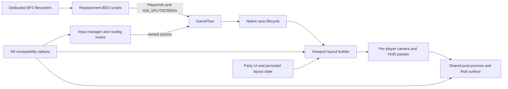
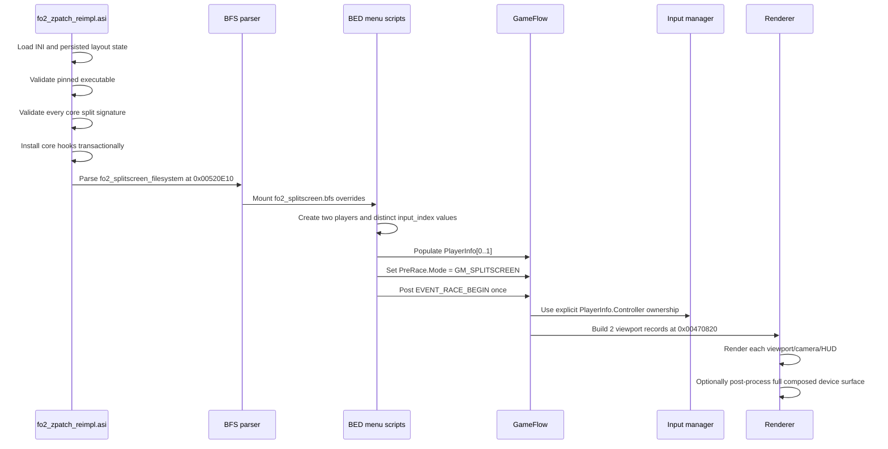
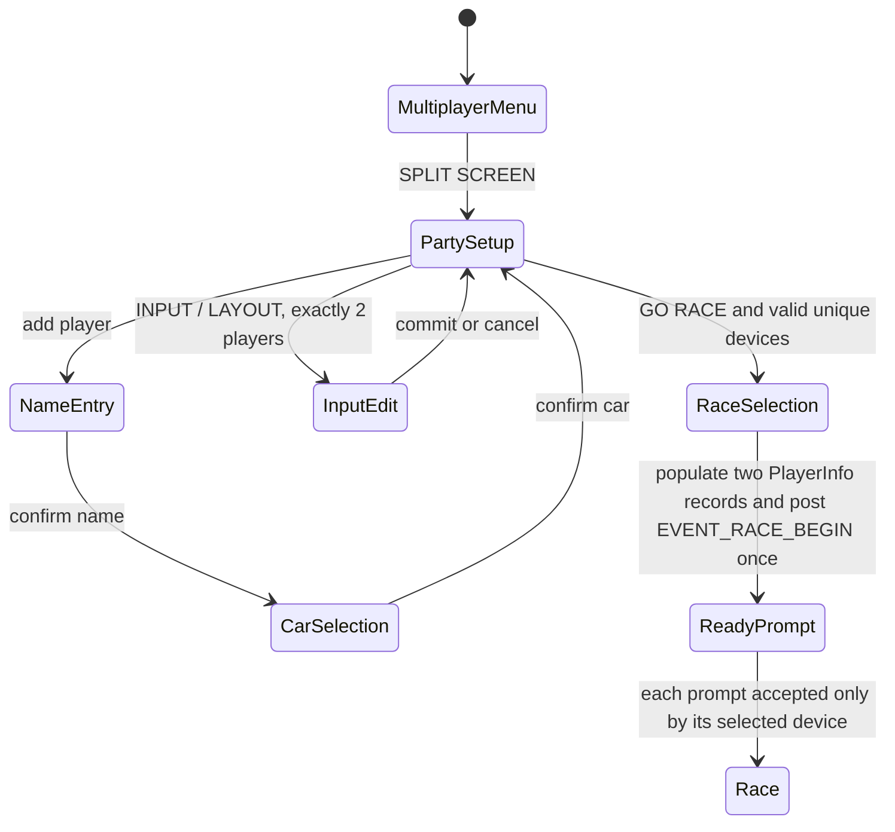

# FlatOut 2 PC split-screen architecture

This document records the evidence, current design, and extension boundary for the
split-screen implementation in `modules/zpatch_reimpl`. Its main purpose is to keep
a future four-player implementation from repeating the two-player reverse-engineering
work or mistaking a dormant rendering path for complete four-player support.

The implementation is experimental and is pinned to the current Steam executable:

| Property | Verified value |
| --- | --- |
| `FlatOut2.exe` SHA-256 | `B7F691D098A167AD0C6C6FF4604DE6F653EFDCF93B6ACBDD03960973A122641F` |
| Image base | `0x00400000` |
| `SizeOfImage` | `0x00541000` |
| PE timestamp | `0x451D02BD` |
| Game mode | `GM_SPLITSCREEN == 10` |
| Current supported player count | exactly 2 |
| Native viewport counts observed in the PC executable | 1, 2, and 4 |

Addresses below are virtual addresses in that executable unless stated otherwise.
They must not be treated as portable offsets for another release.

## System boundary

Split screen crosses four independently fragile layers. A successful menu transition
does not prove that input ownership, rendering, or post-processing is correct.

The repository owns only the replacement menu scripts and the patching layer. Race,
camera, HUD, physics, and viewport iteration remain native engine systems.

## Startup and race lifecycle

Installation order is intentional. The filesystem mount is the last core patch site,
so replacement scripts cannot enter `GM_SPLITSCREEN` until the player-count, ready
ownership, input-routing, and post-process detours are all live. All signatures are
validated before the first core write; any failed write rolls the transaction back.

## Source and asset map

| Concern | Repository source | Runtime artifact |
| --- | --- | --- |
| Split entry, race selection, `PlayerInfo` population | `modules/zpatch_reimpl/assets/splitscreen/data/scripts/multiplayermenu.bed` | `data/scripts/multiplayermenu.bed` in `fo2_splitscreen.bfs` |
| Player creation, car selection, input selector | `modules/zpatch_reimpl/assets/splitscreen/data/scripts/partymodemenu.bed` | `data/scripts/partymodemenu.bed` in `fo2_splitscreen.bfs` |
| Native hooks, version gates, layout, input, post-process | `modules/zpatch_reimpl/fo2_zpatch_reimpl.cpp` | `fo2_zpatch_reimpl.asi` |
| Feature configuration | `modules/zpatch_reimpl/fo2_zpatch_reimpl.ini` | `fo2_zpatch_reimpl.ini` |
| Archive build and verification | `modules/zpatch_reimpl/build_splitscreen_bfs.ps1` | generated `fo2_splitscreen.bfs` and 19-byte `fo2_splitscreen_filesystem` |
| Runtime layout selection | party-menu selector, private native setter events, and `Input.GetSplitscreenLayoutState()` | ASI-owned `fo2_splitscreen_layout.lua` containing exactly `return 0` or `return 1` |

The BFS is a build output, not source. The filesystem file must contain exactly
`fo2_splitscreen.bfs` with no BOM or line ending. The runtime refuses to install the
split hooks if either file is missing or the manifest bytes differ.

## Runtime data model

### GameFlow

The global GameFlow pointer is stored at `0x008E8410`.

| GameFlow location | Meaning | Current use |
| ---: | --- | --- |
| `+0x464` | game mode | must equal 10 before mode-scoped routing, layout rewriting, or the post-process fix activates |
| `+0x614 + i*0x44` | inferred base of `PlayerInfo[i]` | eight records are present in the pinned PC executable |
| `+0x620 + i*0x44` | player type field used by the native counter | `0x0045DC80` compares all eight records |
| `+0x624 + i*0x44` | `PlayerInfo[i].Controller` | zero-based input-device index used by ready ownership |
| `+0x91C` | race/menu state | value 6 identifies the split ready/start prompt for Zoom compatibility |
| `+0x9CC` | current ready-prompt player ordinal | current code accepts only ordinals 0 and 1 |

`0x0045DC80` explicitly tests records at `+0x620`, `+0x664`, `+0x6A8`,
`+0x6EC`, `+0x730`, `+0x774`, `+0x7B8`, and `+0x7FC`. This is strong native
evidence for eight `PlayerInfo` slots. It is not evidence for eight simultaneous
input devices or eight rendered viewports.

### Input manager

The global input-manager pointer is stored at `0x008E844C`. The constructor begins
at `0x0054FF10`.

| Input-manager location | Stock/current meaning | Four-player consequence |
| ---: | --- | --- |
| `+0x04` | registered device count; stock writes 3 | validation and device loops see keyboard plus two pads |
| `+0x08` | logical local-player count; stock writes 1, current hook writes 2 | a four-player prototype must make this 4 without changing the mutable context field |
| `+0x14` | mutable current player/action context; retained at stock value 1 | do not conflate with local-player count again |
| `+0x1C` | keyboard device pointer | device index 0 |
| `+0x20` | first pad device pointer | device index 1 |
| `+0x24` | second pad device pointer | device index 2 |
| `+0x28` | unrelated manager/backend storage, not a proven fourth device pointer | simply raising `+0x04` would interpret unrelated memory as devices and crash |

The constructor creates the two pad objects from backend availability fields at
backend offsets `+0x4674` and `+0x4678`. Therefore the current PC input registry has
a hard structural maximum of three usable entries: keyboard and two pads. Controller
versus controller works for two players; keyboard plus two pads can expose three
distinct devices, but four human players cannot be represented safely.

### Viewport layout

The active layout pointer is stored at `0x00696DC8`. The native builder is
`0x00470820`, called from `0x0045CF1B` with the requested count in `EAX` and the
layout object in `ECX`.

| Layout field | Meaning |
| ---: | --- |
| `+0x30` | viewport count |
| `+0x34 + i*0x18 + 0x00` | x |
| `+0x34 + i*0x18 + 0x04` | y |
| `+0x34 + i*0x18 + 0x08` | width |
| `+0x34 + i*0x18 + 0x0C` | height |
| `+0x34 + i*0x18 + 0x10` | auxiliary value, initialized to 0 |
| `+0x34 + i*0x18 + 0x14` | viewport/player ordinal |

The native builder has explicit branches for two and four viewports:

| Count | Native geometry |
| ---: | --- |
| 1 | one full-device record |
| 2 | top/bottom: `(0,0,W,floor(H/2))`, `(0,floor(H/2),W,floor(H/2))` |
| 4 | 2x2 quadrants using `floor(W/2)` and `floor(H/2)`, ordinals 0 through 3 |

The current orientation transaction is installed for either selected layout so the
party UI can switch without a restart. The vertical path calls the stock builder first
and rewrites only the two records, only in `GM_SPLITSCREEN`. Player 1 receives
`floor(W/2)` pixels; player 2 receives `W-floor(W/2)`, so odd widths have no gap.
Four-player mode should initially retain the native 2x2 builder rather than
generalize the two-player orientation hook.

### Rendering and projection

The render path is count-driven. At `0x004CBB60..0x004CBBF1`, it advances one
`0x18`-byte viewport record per pass, sets the viewport through renderer vtable
offset `+0x30`, and associates each pass with its camera. At `0x004CBC2C` it has a
dedicated chunked path for counts of at least four, updating camera fields `+0x114`
and `+0x118` four at a time before handling any remainder. This is native four-camera
evidence, not a guarantee that HUD or every game mode is correct at four players.

Two projection/aspect sites recognize a count of 2. The viewport builder sets a
render latch only after completing a validated vertical two-record rewrite. That
latch, rather than the transient `GameFlow.Mode` field, selects the vertical aspect
path during later render passes.

| Site | Role | Current vertical behavior |
| ---: | --- | --- |
| `0x004C9E27` | primary split projection/aspect | keeps stock x2 for horizontal; uses x0.5 when the vertical render latch is active |
| `0x004CBD5D` | secondary split projection/aspect | same policy for the second projection path |
| `0x004CBDEF` | widescreen projection extents | derives horizontal extent from the effective aspect at projection `+0x118` |
| `0x004C9F63` | widescreen matrix-object extents | applies the same authoritative-aspect calculation to the matrix object |
| `0x0059964A` | widescreen projection-stack extents | applies the same authoritative-aspect calculation to the projection stack |
| `0x004B9BEB` | singleton race-map render call | centers the map on the full 640-unit HUD canvas only while the vertical render latch is active |

The widescreen extent helpers preserve vertical FOV and use the native effective
viewport aspect exactly once: `V=tan(FOV/2)*near*0.75`, `H=V*aspect` for the matrix
path, with the near term omitted for the stack path. The count-two native hooks are
responsible for making `aspect` twice the device aspect for top/bottom or half the
device aspect for left/right. This avoids the former global-desktop-aspect plus
second split-mode correction.

The runtime orientation patch is a separate four-site transaction: primary aspect,
secondary aspect, singleton race-map call, and layout-builder call. It is installed
even when horizontal is selected so the UI can switch immediately. A missing,
changed, or partially writable site leaves the core split feature installed but
falls back to horizontal. The race-map hook changes only X for map type 1; the one
shared 128-unit map is placed at X=256 on the 640-unit HUD canvas and intentionally
spans the center divider. Horizontal, single-player, and derby maps retain stock
placement.

Four-player projection should use the native count-4 path initially. A 2x2 quadrant
retains the full device aspect ratio, so it does not need the count-2 scalar used by
either top/bottom or left/right halves. The first four-player rendering milestone
must still capture the unpatched count-4 matrices and compare FOV against a one-player
baseline before deciding that no further correction is required.

### Post-processing

The stock call at `0x004CBB26` invokes renderer vtable offset `+0x150` once after the
per-viewport scene passes while the final player's viewport is still selected. This
caused only player 2 to receive visible post-processing in two-player mode.

With `SplitscreenPostProcessingFix=1`, the hook:

1. validates a viewport count from 2 through 4;
2. snapshots the final `0x18`-byte layout record;
3. selects the full device surface through renderer vtable offset `+0x30`;
4. runs post-processing once; and
5. restores the final viewport geometry and ordinal.

The count range already includes four, and restoration is layout-driven, so no
four-player code change should be made here until a four-player visual test fails.
The option remains experimental because shaders can still assume a single viewport
or sample across split boundaries.

## Input and ready-prompt ownership

The scripts store zero-based device indices in `state.players[i].input_index`, then
write them to `PlayerInfo[i].Controller`. They validate integer range, uniqueness,
hot-plug count changes, and require two devices before entering the selector.

The native ready prompt needs additional ownership enforcement:

| Site | Hook behavior |
| ---: | --- |
| `0x0045BC5E` | compares event source at event `+0x10` with the current ordinal's explicit `PlayerInfo.Controller`; rejects wrong devices before the stock duplicate-source check |
| `0x0055D557` | bypasses stock held-input routing restriction only in `GM_SPLITSCREEN` |
| `0x0055D627` | bypasses stock pressed-input routing restriction only in `GM_SPLITSCREEN` |
| `0x0055D705` | preserves explicit pressed controller routing in `GM_SPLITSCREEN` |
| `0x0055D785` | preserves explicit held controller routing in `GM_SPLITSCREEN` |

The current ready-owner code deliberately rejects `target_ordinal >= 2`; a four-player
implementation must make this bound runtime-count-driven and validate all four
`PlayerInfo.Controller` values.

Zoom Platform's `fo2_zoom.dll` converts pad A/Start to a synthetic keyboard Return,
which erases device identity. The optional compatibility hook is version-gated to
timestamp `0x692D78D4`, image size `0x00106000`, and exact vector RVAs
`0xFECFC/0xFED00` with a `0x3C` record stride. It latches the originating pad slot
and restores that identity only for the active split ready prompt. If Zoom is absent,
the hook is not needed; if an unknown Zoom build is present, it fails closed without
changing the core split patch. Older game installations without Zoom therefore need
no Zoom-specific code path.

## Runtime layout selector

The party screen treats layout as a third row after the two device rows. The row is
not a player and must not be included in player/device validation. Left or right
toggles the Boolean `state.split_vertical`, posts the matching private event, updates
the wide-string label, and persists through the native event handler. The current
labels are `VERTICAL (LEFT / RIGHT)` and `HORIZONTAL (TOP / BOTTOM)`.

Editing is transactional from the user's perspective:

| Action | Device assignments | Layout |
| --- | --- | --- |
| open `INPUT / LAYOUT` | snapshot both indices | snapshot current selection |
| left/right on a device row | change or swap live menu state | unchanged |
| left/right on row 3 | unchanged | applies immediately and writes state |
| confirm | validate device count/range/uniqueness, retain changes | re-apply and retain |
| cancel, menu back, or deinit during editing | restore snapshots | re-apply and persist original selection |

`Input.GetSplitscreenLayoutState()` returns a numeric bit field: bit 0 means Vertical
is active and bit 1 means the native Vertical transaction is available. The party
script queries it at initialization and immediately after each setter event, treating
any invalid result as Horizontal/unavailable. It never calls `loadfile` or `dofile`
for the game-root state artifact. The ASI owns loading and atomic persistence, so a
missing file cannot become a BED fatal error and a native fallback is reflected in
the label synchronously. If capability is unavailable, the third row displays a
non-changing Horizontal fallback. Labels and widget titles remain wide strings
through `L(...)`, `ConvertToWString`, and `WStringConcat`.

## Script state machine and current two-player assumptions

The following assumptions must all be removed or generalized together for four
players. Changing only the visible menu maximum will produce a crash or unwinnable
ready prompt.

| Current assumption | Location/function | Required four-player form |
| --- | --- | --- |
| `players.num_players ~= 2` aborts | `multiplayermenu.bed`, `StartSplitscreen` | accept only a deliberately supported set, initially `{2,4}` |
| loops validate `1,2` | `StartSplitscreen` and split-input helpers | loop through `state.num_players` |
| `maxplayers = 2` | `partymodemenu.bed`, `set_buttons` | set 4 only after the input backend can expose four unique devices |
| selector widgets exist for players 1 and 2 | `SetPlayerBars`, `menu_partymode.init` | generate rows/widgets up to supported split count |
| selector snapshots and restores two indices | `start_splitinput`, `end_splitinput`, `deinit` | snapshot/restore `state.num_players` entries |
| layout row is represented as selector row 3 | `splitinput_setselected`, `cycle_splitinput`, input handler | keep orientation separate from player count when rows become data-driven |
| launch validator requires exactly two | `SplitControllerLaunchError` | count-driven validation |
| ready-owner ordinal bound is 2 | `ShouldAcceptSplitscreenReadyOwner` | bound by the configured split player count and available `PlayerInfo` records |
| logical input-manager player count is 2 | `SplitscreenPlayerCountHook54FF2E` | use a validated runtime configuration, with a separate unchanged current-context field |
| vertical rewrite requires viewport count 2 | `RewriteVerticalSplitscreenLayout` | keep this restriction; use native 2x2 layout for four players |

## PC and PS2 evidence

The PS2 ISO was inspected read-only from `C:\Users\admin\Downloads\fo2.ISO`; its
`FLATOUT.BFS` contains the original split-screen menu scripts and shared assets.

| Evidence | Result | Interpretation |
| --- | --- | --- |
| PS2 `partymodemenu.bed` sets split `maxplayers = 2` | verified | shipped PS2 UI supports two, not four |
| PS2 party script contains `num_players == 2 or num_players == 4` | verified but unreachable under the preceding maximum | useful dormant script evidence only |
| PS2 `multiplayermenu.bed` writes `playerinfo.Controller=i-1` and `GM_SPLITSCREEN` | verified | establishes the intended per-player controller field and mode |
| PC `0x00470820` contains explicit count-4 2x2 layout | verified by disassembly | strongest PC-native four-viewport evidence |
| PC `0x004CBC2C` contains a four-camera chunk | verified by disassembly | renderer/camera path was written for at least four passes |
| PC `0x0045DC80` scans eight `PlayerInfo` records | verified by disassembly | game-flow data model is not limited to two |
| PC input constructor creates keyboard plus two pads | verified at `0x0054FF10..0x00550020` | hard blocker for four distinct human inputs |

The following PS2 and retail-PC payloads are byte-identical:

| Asset | SHA-256 |
| --- | --- |
| `data/global/overlay/hud.bed` | `7BE83474F820C178E1382527C8A0C598AAEA35AE4E6793217CB88D05402E7659` |
| `data/global/overlay/splitscreen_nitro.bed` | `243C3B2439EAAB835C6B7AF7D522761BE018D009F47EF06C367953F2F82C6BE1` |
| `data/cars/car_1/camera.ini` | `802BA93AFCE48F54271E2E7669FDD5F145580A6B22CE796FD1CD5350204808A6` |
| `data/cars/car_1/splitcamera.ini` | `0BC1193DF850C38A932A5317DF4B8373F81D55EF4F9E262D63D1C4B05C762FA6` |

This is evidence that the PC data archive retained console split-screen HUD and
camera assets. It does not prove that those assets lay out correctly in four small
quadrants; that remains a visual acceptance test.

## Patch manifest

### Core split transaction

| Site | Stock bytes/purpose | Hook |
| ---: | --- | --- |
| `0x0054FF2E` | `89 7D 14 89 7D 08`; current-context and logical-player-count stores | `SplitscreenPlayerCountHook54FF2E` |
| `0x0045BC5E` | 18-byte ready-prompt source/context sequence; first 5 bytes replaced | `SplitscreenReadyOwnerHook45BC5E` |
| `0x0055D557` | `83 7A 04 00 75 04` | `SplitscreenHeldRoutingHook55D557` |
| `0x0055D627` | `83 7A 04 00 75 04` | `SplitscreenPressedRoutingHook55D627` |
| `0x0055D705` | `3C FF 74 37 55` | `SplitscreenPressedControllerHook55D705` |
| `0x0055D785` | `3C FF 74 36 55` | `SplitscreenHeldControllerHook55D785` |
| `0x004CBB26` | renderer post-process dispatch sequence | `SplitscreenPostProcessingHook4CBB26` |
| `0x004A738A` | first controller-constant registration after the stock `Input` methods | `SplitscreenInputRegistrationHook4A738A` |
| `0x0048D2F5` | call to stock numeric-event descriptor lookup | `SplitscreenEventDescriptorHook48D2F5` |
| `0x0048D4C0` | built-event null check and queue path; first 6 bytes replaced | `SplitscreenPostEventHook48D4C0` |
| `0x00520F7E` | `push 0x00677DF8`; stock `-binarydb` setup | `SplitscreenFilesystemHook520F7E` |

### Vertical two-player transaction

| Site | Stock bytes/purpose | Hook |
| ---: | --- | --- |
| `0x004C9E27` | `8B C3 83 E8 02 75 02 DC C0` | `ProjectionSplitModeHook` |
| `0x004CBD5D` | `8B C6 83 E8 02 75 02 DC C0` | `ProjectionSplitModeSecondaryHook4CBD5D` |
| `0x004B9BEB` | `E8 F0 BE 00 00`, singleton map-render call | `SplitscreenRaceMapHook4B9BEB` |
| `0x0045CF1B` | `E8 00 39 01 00`, call to native viewport builder | `SplitscreenViewportLayoutCall45CF1B` |

The vertical transaction additionally validates the surrounding caller bytes at
`0x0045CF11..0x0045CF25`. Both transactions verify the installed branch target and
NOP padding, not just whether the write API returned success.

The UI/native bridge reserves event IDs `0x7F020001` (horizontal) and `0x7F020002`
(vertical). The descriptor hook delegates every other ID to the stock lookup. The
post-event hook consumes only those two fully built private events and replays the
stock null-check/queue path for all others. Core installation scans the stock event
table first and fails closed if either private ID is already registered. Selection is
stored by writing an eight-byte temporary file, flushing it, and atomically replacing
`fo2_splitscreen_layout.lua`. Missing or invalid state defaults to vertical; native
orientation-hook failure forces and persists horizontal. The registration hook adds
`Input.GetSplitscreenLayoutState()` to the existing `Input` Lua table before the BFS
override is mounted. Its 0..3 result reports live orientation/capability directly;
BED code never opens the persisted file.

## Four-player blockers and risks

| Priority | Blocker/risk | Why it matters | Exit condition |
| ---: | --- | --- | --- |
| P0 | only three registered PC input devices | four unique `Controller` indices cannot exist; raising the count reads unrelated manager/backend storage and then out-of-object memory | four independently addressable, hot-pluggable devices pass held/pressed/ready ownership tests |
| P0 | two-player constants across scripts and native guards | partial generalization can start with uninitialized `PlayerInfo`, reject P3/P4, or rebuild missing widgets | every player-count loop and bound derives from one supported count |
| P1 | count-4 projection behavior unmeasured | native layout does not prove correct aspect/FOV | captured matrices and reference screenshots demonstrate consistent FOV in all quadrants |
| P1 | HUD safe area and legibility | PS2/PC asset equality proves presence, not four-quadrant usability | position/lap/map/nitro/readiness UI fits at 16:9, ultrawide, and 4:3 |
| P1 | ready-prompt and Zoom identity for ordinals 2/3 | current bound and latch assumptions are two-player | each of four selected devices can accept only its own prompt |
| P2 | performance and memory pressure | four cameras multiply scene, particles, mirrors, HUD, and effects | stable frame pacing and no growth/leak across repeated races |
| P2 | post-process shaders with screen-space sampling | full-frame pass can bleed across quadrant edges | representative effects show no seams or cross-viewport contamination |

The input fix must not be implemented as a one-byte/count patch. Safe candidate
designs are:

1. extend or replace the registry with an allocated device-pointer table and patch
   every proven enumerator/accessor;
2. construct additional game-native pad objects only if their backend can be proven
   to enumerate more than two physical pads; or
3. add a split-mode-only virtual input layer that exposes stable device indices and
   feeds the game's held/pressed action paths directly.

Each option requires a complete xref manifest for device count `+0x04`, pointer base
`+0x1C`, direct `+0x20/+0x24` consumers, destruction, focus loss, hot-plug, and
controller-name queries before the first implementation write.

## Staged four-player roadmap

### Stage 0: evidence and instrumentation

- Add debug-only logging for active split count, each `PlayerInfo.Controller`, input
  device count/name, layout records, camera count, and ready ordinal.
- Produce the complete input-manager xref/access manifest described above.
- Capture one-player, native two-player, vertical two-player, and forced four-viewport
  projection values without changing projection code.
- Define one authoritative `supported_split_players` value; do not independently
  hard-code 4 in scripts and C++.

Exit: no unknown input registry consumer and a reviewable count/data trace from menu
entry through the first rendered frame.

### Stage 1: render-only four-viewport harness

- Populate four valid local `PlayerInfo` records with a controlled development path.
- Set logical player count to four while retaining current-context value 1.
- Use the stock `0x00470820` 2x2 layout unchanged.
- Keep the regular user menu capped at two and label the harness non-playable until
  four input devices exist.
- Verify cameras, HUD, respawn, pause, finish order, results, and repeated race entry.

Exit: a complete four-view race renders and returns to menus without corruption;
input independence is explicitly out of scope for this stage.

### Stage 2: four-device input backend

- Implement the selected registry/virtual-device design transactionally.
- Expose stable zero-based indices and names through the APIs used by BED scripts.
- Generalize held/pressed routing, ready-owner bounds, focus loss, and hot-plug.
- Preserve stock behavior outside `GM_SPLITSCREEN`.
- Treat keyboard as one device; support at least keyboard plus three pads and four
  pads, with duplicate physical devices rejected.

Exit: four devices simultaneously drive four assigned cars and no device can accept
another player's ready prompt.

### Stage 3: data-driven UI

- Raise the split player maximum to four only after Stage 2.
- Generate input rows, selector snapshots, validation loops, and add/remove state from
  `state.num_players` rather than literal 2.
- Preserve all wide strings through `ConvertToWString`, `WStringConcat`, and `L(...)`;
  never concatenate a Lua narrow string directly into a widget title.
- Define deterministic swap semantics when a selected device is already owned.
- Handle device loss by displaying `< NOT ASSIGNED >` and blocking launch.
- Keep menu controller masks reset when leaving setup for shared race selectors.

Exit: add/remove/back/re-enter/hot-plug flows work for 2 and 4 players without stale
focus, missing widgets, shifted car lists, or lost first characters in names.

### Stage 4: visual policy and release hardening

- Tune four-player HUD safe areas only if tests prove the shared assets insufficient.
- Add four-player projection changes only from captured evidence.
- Validate post-processing off and on; retain off as a safe fallback.
- Repeat signature validation against every explicitly supported executable and reject
  unknown builds without partial installation.
- Remove debug artifacts and retain concise failure diagnostics in the release log.

Exit: the full test matrix passes on a clean install and with known compatibility
mods, and every unsupported binary fails safely before script mount.

## Acceptance test matrix

### Build and packaging

| Test | Expected result |
| --- | --- |
| clean build with no checked-in `fo2_splitscreen.bfs` | archive and 19-byte no-newline filesystem manifest are generated |
| list/extract generated archive | exactly the two expected BED paths are present and hashes equal the source files |
| second build using cached tool | succeeds offline and verifies the same file set/content |
| missing archive or changed manifest bytes at runtime | no split hooks are installed; log identifies the prerequisite failure |

### Current two-player regression

| Players/devices | Orientation | Zoom | Post-process | Expected result |
| --- | --- | --- | --- | --- |
| keyboard + pad | horizontal and vertical | absent | off/on | both prompts accept only the assigned device; both cars drive independently |
| pad + pad | horizontal and vertical | absent | off/on | both pads remain distinct through setup, ready prompts, race, pause, and results |
| keyboard + pad | horizontal and vertical | supported build | off | pad-synthesized Return retains pad identity; keyboard cannot accept pad-owned prompt |
| pad + pad | horizontal and vertical | supported build | off | each synthesized Return accepts only its own prompt |
| any valid pair | missing/invalid layout state file | any | any | selector and runtime default to vertical |
| any valid pair | simulated native orientation signature failure | any | any | core split remains available, selector/runtime are forced horizontal |
| odd device width, for example 1365 | vertical | any | any | widths are 682 and 683 with no gap or overlap |
| device unplugged in selector | either | any | any | assignment becomes invalid, launch is blocked, no out-of-range name query occurs |

Also verify add/remove/back/re-enter, changing names, swapping devices, car selection,
track selection, restarting a race, and returning to all non-split modes. Non-split
party, career, single race, replay, LAN, and online menus must remain stock because
all behavioral routing hooks are intended to be `GM_SPLITSCREEN`-scoped.

### Future four-player gates

| Area | Required cases |
| --- | --- |
| device topology | four pads; keyboard plus three pads; disconnect/reconnect every slot; reconnect in a different OS order |
| ownership | for each prompt, test all four devices; exactly one must accept |
| layout | 4:3, 16:9, 16:10, 21:9; even and odd width/height; window resize/reset if supported |
| camera/FOV | chase, bumper, hood, reverse/look-back, crash/reset, finish camera |
| HUD | position, lap, minimap, speed, nitro, warnings, pause, ready overlay, results |
| race types | race, derby, and every mode the UI exposes; explicitly reject unsupported stunt/event paths |
| post-process | off/on; motion blur, bloom, damage/flash effects, split boundaries, final viewport restoration |
| lifecycle | repeated race start/finish/restart, return to menu, change player count 4 to 2 and 2 to 4 |
| compatibility | no Zoom, supported Zoom, unknown Zoom, known input wrapper mods, clean Steam install |
| performance | frame time, one-percent lows, memory growth, long race, particle-heavy pileup |

## Rules for future patches

- Gate by image base, image size, PE timestamp, and exact local signatures.
- Validate every member of a multi-site feature before the first write.
- Verify installed branches and roll back the whole feature on failure.
- Mount scripts last so data cannot select a mode whose native support is partial.
- Scope behavioral changes to `GM_SPLITSCREEN`; startup allocation/count changes need
  separate proof that other modes are unaffected.
- Keep core split, orientation, post-processing, and third-party compatibility as
  separable fallbacks.
- Prefer native count-driven systems when evidence shows they already handle four;
  do not replace the viewport builder or post-process logic pre-emptively.
- Distinguish "native dormant code exists" from "feature is user-ready." The input
  registry is the clearest example of why those are not equivalent.

## Open questions

1. Which functions read the input-manager pointer array directly rather than through
   count-driven loops, and can all of them be safely redirected?
2. Can the existing pad class/backend enumerate pad slots 3 and 4, or is a new XInput
   bridge required?
3. What projection matrix does the unmodified count-4 path produce at each aspect
   ratio, and is its FOV policy intentional?
4. Does every HUD element use viewport-relative coordinates for four quadrants?
5. Are pause and results owned by one designated player or any local player in the
   dormant four-player path?
6. Does full-frame post-processing sample across quadrant boundaries for any shipped
   or Zoom-provided shader?

These questions are gates for implementation, not invitations to broaden the first
four-player patch. The lowest-jank path is to reuse the native four-viewport and
eight-player data structures, then solve the PC input registry as a discrete,
well-instrumented subsystem.
